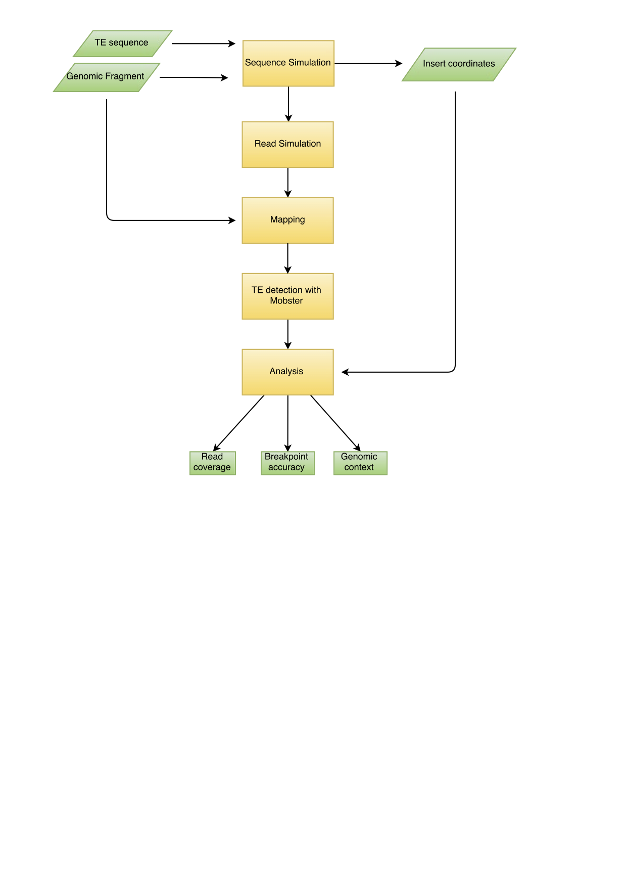

# ESAT – Element Simulating Analysis Tool

ESAT is a tool that simulates the insertion of elements in a genomic sequence and evaluates the detection rate with Mobster.


## Requirements

To run phython scripts individually use python3.4

### Programs 
Additional programs that are required to run the pipeline:

* Bedtools (version 2.17, http://bedtools.readthedocs.org/en/latest/)
* Bwa (version 0.7.5a-r405, https://sourceforge.net/projects/bio-bwa/files/)
* Mobster (http://sourceforge.net/projects/mobster)
* Mosaik (version 2.2, https://github.com/wanpinglee/MOSAIK.git/)
* Picard (https://broadinstitute.github.io/picard/)
* Simseq (https://github.com/jstjohn/SimSeq)
* Samtools (version 1.3, https://github.com/samtools/samtools/)


### Additional Files

* Error Profile for SimSeq (https://github.com/jstjohn/SimSeq)
* Repetitive elements for Mobster


## Run the Pipeline
### Start the pipeline with

```bash
bash ESAT.sh <genomic fragment> <TE sequence> <Name of the output files> <Coverage of the read simulation> <Number of insertions> <ID>
```

or

### Start loop with

```bash 
bash loop.sh <genomic fragment> <TE sequence> <Output name>
```

* loop generates new ID for every individual run but sam, bam, fastq (etc) files will be overwritten in each run!


## The pipeline

### Steps in the pipeline:

* Sequence Simulation sim_seq.py; Output: simulated sequence (fasta), insert breakpoints (.bed)


* bwa indexing of the new sequence
* Sort insert brekpoints file
* Calculation of read number read_number.py

* read Simulation
	 (change arguments -1 and -2 for different read length (set to 90), use error profile here, 	  	change insert size (set to 500))

* Mapping with bwa
* Generate mobster properties file
* Generate vcf file  mobster2vcf_python3.py
* Compare real breakpoints with simulated breakpoints compare_insertions.py
* Generate output summary file

### Output:

* Use Name.sorted.mkdup.bam to view mapped reads
* Use ID.insertions.sorted.bed for original breakpoints (insert locations)
* Use Name.analysis.txt output with original and predicted preakpoints (original beakpoint, breakpoint end, Mobster prediction, Coverage, Type, ID)





